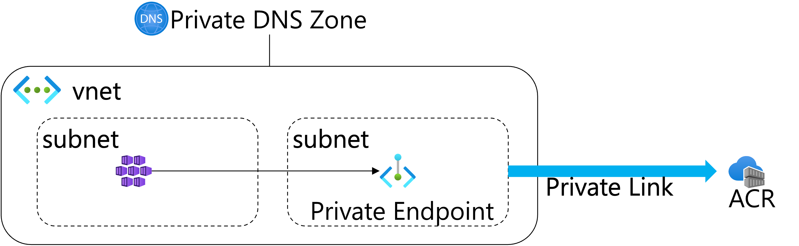
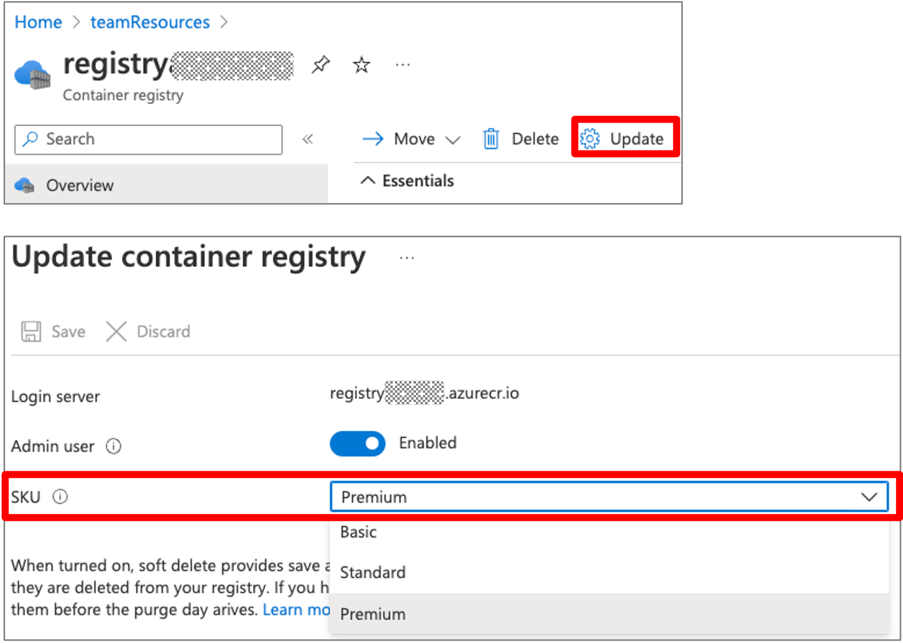

# Azure Container Registry との統合

Azure Kubernetes Service(AKS)でAzure Container Registry(ACR)を使用する時の認証の仕組みを設定します。
新規クラスタ作成時は `--attach-acr` オプションで統合するACRを指定するすることが可能です。
ここでは既存AKSクラスタとACRを統合していきます。

## 環境変数の準備

リソースグループ、AKSのクラスタ名、ACR名を環境変数に設定します。

```
export RG_NAME=mygroup
export AKS_NAME=myaks
export ACR_NAME=myacr
```

## AKSクラスタの設定を更新

```
az aks update -n $AKS_NAME -g $RG_NAME --attach-acr=$ACR_NAME
```


## Private Endpointを使ってAKSからACRに接続




Private Endpointを有効にするには、ACRはPremiumのSKUが必要なので、Premiumでない場合は、AzureポータルかAzure CLIでSKUを更新します。

### Azure ポータルで変更


### Azure CLIで更新

```
az acr update  -n $ACR_NAME] -sku Premium
```

### Prinvate Endpointの指定

※事前にPrivate EndpointようにSubnetを作成しておく

1. Azure ポータルでAzure Container Registryを選択
2. 左Paneの設定セクションで「ネットワーク」をクリックして、右Paneで設定変更

**パブリックアクセス**

パブリックネットワークアクセスで「無効」を選択して「保存」

**プライベートアクセス**

「＋プライベートエンドポイント接続を作成します」をクリックしてウィザーとを開始

#### (1) 基本

**インスタンスの詳細**

| | |
| ---- | ---- |
|名前|Private Endpointの名前。わかりやすいものを指定|
|ネットワークインターフェイス名|名前を指定すると自動的に設定される。変更も可能|
|地域|利用するSubnetのリージョンを指定。VNETがJapan EastならばここもJapan Eastを指定|

#### (2) リソース

| | |
| ---- | ---- |
|対象サブリソース|registryが自動選択される|

#### (3) 仮想ネットワーク

**ネットワーク**

| | |
| ---- | ---- |
|仮想ネットワーク| 利用するVNETを選択|
|サブネット|Private Endpointを作成するSubnetを選択|

**プライベートIP構成**
「IPアドレスを動的に割り当てる」を選択

**アプリケーションセキュリティグループ**

追加ぜず

#### (4) DNS

**プライベートDNS統合**

推奨のプライベートDNSゾーン名が自動的に設定される

[AzureサービスDNSゾーンの構成:推奨されるゾーン名](https://learn.microsoft.com/ja-jp/azure/private-link/private-endpoint-dns#azure-services-dns-zone-configuration)

#### (5)タグ

設定せず

#### (6)確認および作成

検証が終わったら「作成」をクリック


## 参考
* [Azure Kubernetes Service から Azure Container Registry の認証を受ける](https://learn.microsoft.com/ja-jp/azure/aks/cluster-container-registry-integration)
* [Azure Private Link を使用して Azure Container Registry にプライベートで接続する](https://learn.microsoft.com/ja-jp/azure/container-registry/container-registry-private-link)