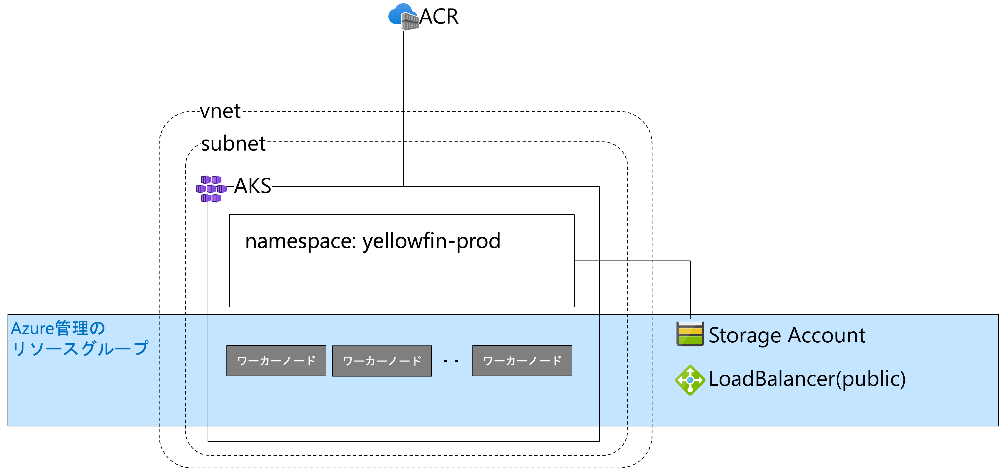
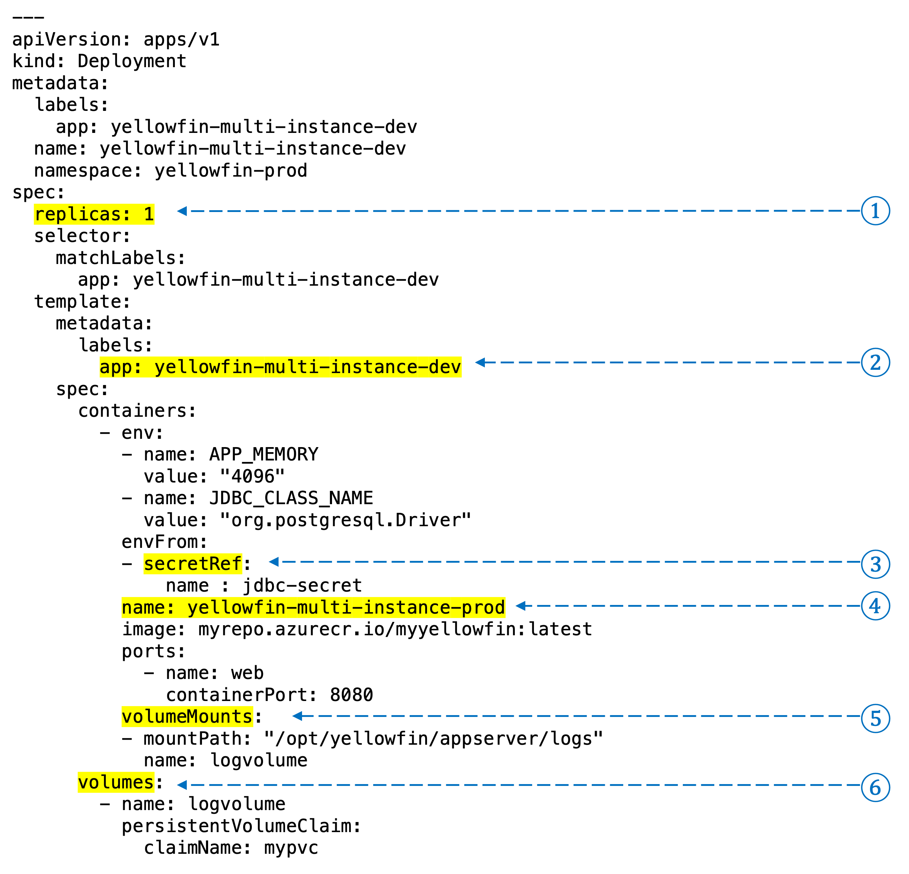
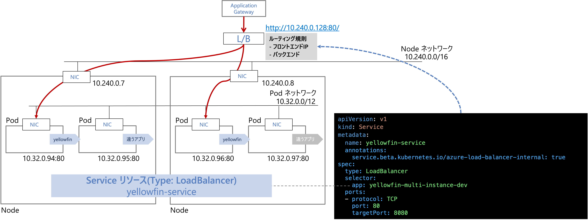

# 本番環境用のYellowfinアプリケーションのデプロイ手順

## AKSの環境

AKSデプロイ時はAzure管理のリソースグループが生成され、ワーカノード、永続ボリューム用のストレージ、ロードバランサーなどが生成される。

※自作のVNETを指定しないでデプロイした場合は、VNETもAzure管理のリソースグループに生成される。




### AKSデプロイ手順
1. [AKSのデプロイ readme.md ](./readme.md)
2. [AKSとACRの統合 aks_attach_acr.md](./aks_attach_acr.md)


### オプション - ストレージアカウントの作成
Azure管理のリソースグループにあるストレージアカウントではなく自作のストレージアカウントを利用する場合は、Azureのストレージアカウントの作成、kubernetesのストレージクラスの作成をする。
ここでは、作成済みの自身のストレージアカウントをAKSで利用する永続ボリュームとして利用するための設定を行う。

詳細な手順は、[ボリュームの利用 - 永続ボリューム（自作のストレージクラスを利用する場合）　volume.md](./volume.md)を参照


## Yellowfinアプリケーションのデプロイ

Yellowfinアプリケーションの実行に必要なkubernetesのオブジェクトは、同じnamespaceに作成する。
作成する対象は、
* Namespace - Kubernetesのオブジェクトを論理的にまとめる単位
* Pod - Yellowfinアプリケーション
* Service - Pod用のkubernetes内部のロードバランサー
* Secret - データベース接続のJDBC URL、ユーザ、パスワードなどを保持する
* Persistent Volume Claim - 永続ボリューム要求。Yellowfinアプリケーションの永続データを保存するボリュームのリクエスト。このリクエストにしたがって、kubernetesがボリュームを割り当てる。コンテナ内からはマウントしたストレージのとして扱える


以降の手順では、yellowfin-prod というnamespaceにアプリケーションをデプロイする想定とする。

1. Namespaceの作成
2. Secretの作成
3. Persistent Volume Claimの作成
4. Podのデプロイ
5. Serviceのデプロイ


サンプルのマニフェストファイルは、「yellowfin-prod」というネームスペースにデプロイするように metadata.namespace が設定されている。変更する場合は、この部分を任意の値に変更するか、kubectl コマンドで実行する場合は　`-n [ネームスペース]`で指定する。
namespaceを指定しない場合は、defaultネームスペースに作成されるので要注意。

### 1. Namespaceの作成

***kubectlコマンドで実行する場合***

```
kubectl create ns yellowfin-prod
```

namespace一覧の確認
```
kubectl get ns
```

特定のnamespaceの確認
```
kubectl get ns yellowfin-prod
```

***AzureポータルにYAMLを貼り付けて実行する場合***

1. Azureポータル画面でAKSサービスの管理画面を開く
2. 左Paneのkubernetesリソースセクションで「名前空間」をクリック
3. 右Pane上部の「＋作成]メニューをクリックし、メニューアイテムからNamespaceを選択
4. ダイアログでNameに「yellowfin-prod」と入力（Labels は空白のままでOK)


### 2. Secretの作成

YellowfinアプリケーションのリポジトリDBに接続するためのユーザ、パスワード、JDBC URLなどの秘匿応報を保持するSecretを作成。
secret.yamlを作成する場合には、必要な値をbase64でエンコーディングして記述する必要がある。
サンプルは、[jdbc-secret.yaml](./manifest/jdbc-secret.yaml)参照。


ここでは、Key=Value形式のファイルを生成してSecretを登録する。

#### (1) Postgresql FlexibleサーバのJDBC URLを確認
1. AzureポータルでPostgresqlの管理画面を開く
2. 左Paneの設定セクションの「接続文字列」をクリック
3. 右PaneのJDBCに記載されているJDBC URLをメモしておく

#### (2) jdbc.envファイルの作成

メモしておいたJDBC URLから必要な内容をKey=Value形式で定義する。

```
JDBC_CONN_PASS=[Postgresqlのパスワード]
JDBC_CONN_ENCRYPTED=false
JDBC_CONN_URL=jdbc:postgresql://[DBサーバのFQDN]:5432/[YellowfinのDBスキーマ]?sslmode=require
JDBC_CONN_USER=[Postgresqlのユーザ名]
```

#### (3) secretの登録

_(2)_ の手順で作成したjdbc.envが保存されているディレイクトリでsecretを作成

```
kubectl create secret generic jdbc-secret --from-env-file=jdbc.env -n yellowfin-prod
```


#### (4) secretの確認

***kubectlコマンド実行する場合***

secretの一覧の取得
```
kubectl get secret -n yellowfin-prod
```
secretを指定して確認
```
kubectl get secret jdbc-secret -n yellowfin-prod
```

内容を確認する場合。ただし、値はbase64でエンコードされている。
```
kubectl get secret jdbc-secret -n yellowfin-prod -o yaml
```

***Azureポータルで確認する場合***

1. AzureポータルでAKSの管理画面を開く
2. 左PaneのKubernetesリソースセクションの「構成」をクリック
3. 右Paneの上部の「シークレット」をクリックしてシークレットの一覧を表示
4. 右Paneの一覧で「jdbc-secret」をクリック
5. 右Pane下部のデータセクションのテキストフィールド右端の「目」みたいなマークをクリックすると平文で値が表示される

### 3. Persistent Volume Claim の作成

Yellowfinのログ出力用に利用する永続ボリューム要求を作成する。
ここでは、AKSデプロイ時に作成されているストレージクラス azurefile-csiを利用する手順を説明する。

#### (1) PVCの作成

[サンプル manifest/azurefile-pvc.yaml](./manifest/azurefile-pvc.yaml)を利用して、Persistent Volume Claim を作成する。作成後少し待つと、少し待つと、Persistent Volue Claimが永続ボリュームと関連づけられる。

***kubectlコマンドで実行する場合***

```
kubectl apply -f azuerfile-pvc.yaml
```

PVCの確認
```
kubectl get pvc -n yellowfin-prod
NAME    STATUS   VOLUME                                     CAPACITY   ACCESS MODES   STORAGECLASS    AGE
mypvc   Bound    pvc-1cc68180-0e1c-4fb1-b286-24861da6f640   5Gi        RWX            azurefile-csi   6d3h
```

***Azureポータルで実行する場合***

1. AzureポータルでAKSの管理画面を開く
2. 左PaneのKubernetesリソースセクションで「ストレージ」をクリック
3. 右Pane上部の「＋作成」をクリックし、プルダウンメニューからYAMLで作成をクリック
4. azurefile-pvc.yamlの貼り付けて作成

5. 永続ボリューム要求の一覧でボリュームにBoundされたことを確認する


### 4. Yellowfin アプリケーションのデプロイ

Secret, PVCが正しく生成されていることを確認後、[サンプル manifest/deployment-pvc.yaml](./manifest/deployment-pvc.yaml)を利用してYellowfinアプリケーションをデプロイする。




#### ① replicas
デプロイ時のPodの多重度を指定する

#### ② labels.app.yellowfin-multi-instance-dev
Label/Selectorの仕組みでServiceがバックエンドのPodを認識するためのラベル

#### ③ secretRef.name
DB接続情報を保持しているシークレット名を指定する

#### ④ name
Yellowfinアプリのホスト名の接頭辞になる文字列。
ホスト名として扱われる文字列の例）yellowfin-multi-instance-prod-5c9fd6d4fb-hmvhw

#### ⑤ volumeMounts と ⑥ volumes
volume.name (サンプルの値は logvolume)は、コンテナから参照するマウント先のボリューム名。 volumeMountsでコンテナ内のマウントパスとどのボリュームをマウントするかを指定する。


***kubectlコマンドで実行する場合***

```
kubectl apply -f deployment-pvc.yaml
```

デプロイの確認
```
kubectl get all -n yellowfin-prod
```
で、pod, deployment, replicaset があることを確認する。

Podのログの確認方法
```
kubectl get pods -n yellowfin-prod

## Pod名が出力される
NAME                                            READY   STATUS    RESTARTS   AGE
yellowfin-multi-instance-dev-546459c69f-bp28s   1/1     Running   0          19m

kubectl logs -f yellowfin-multi-instance-dev-546459c69f-bp28s -n yellowfin-prod
```

Podが正常にデプロイできない場合は、kubernetesのイベントを確認する。コンテナイメージのpullやリソース割り当てなのどイベントを確認できるので、それを元にトラブルシューティングを行う。
```
kubectl get events -w -n yellowfin-prod
```
※ `-w` オプションをつけると、watchモードでの出力となりイベントが順次コンソールに出力される


***Azureポータルで実行する場合***

1. AzureポータルでAKSの管理画面を開く
2. 左PaneのKubernetesリソースセクションで「ワークロード」をクリック
3. 右Pane上部の「＋作成」をクリックし、プルダウンメニューからYAMLで作成をクリック
4. deployment-pvc.yamlの貼り付けて作成


### 5. Serviceのデプロイ
クラスタ外からAzure Load Balancer経由でトラフィックを扱えるようにLoadBalancerタイプのServiceをデプロイし、ipアドレス指定でPodにアクセスできるようにする。
AKS上のアプリケーションに直接外部からアクセスするので把握、Azure Application Gateway経由でアクセスするのでPublicなロードバランサではなくInternalなロードバランサを経由してアクセスするので、Serviceのアノテーションで`metadata.annotations.service.beta.kubernetes.io/azure-load-balancer-internal`を`true`に設定する。
[サンプル manifest/service_internalLB.yaml](./manifest/service_internalLB.yaml)を利用してInternal Load BalancerタイプのServiceをデプロイする。




***kubectlコマンドで実行する場合***

```
kubectl apply -f service_internalLB.yaml
```

IPアドレスを確認。EXTERNAL-IPに記載されているのが、Application Gatewayのバックエンドとして指定するIPアドレス
```
kubectl get svc -n yellowfin-prod
NAME                           TYPE           CLUSTER-IP    EXTERNAL-IP   PORT(S)        AGE
yellowfin-multi-instance-dev   LoadBalancer   10.0.196.32   10.1.1.6      80:30322/TCP   3m54s
```


***Azureポータルで実行する場合***
1. AzureポータルでAKSの管理画面を開く
2. 左PaneのKubernetesリソースセクションで「サービスとイングレス」をクリック
3. 右Pane上部の「＋作成」をクリックし、プルダウンメニューからYAMLで作成をクリック
4. service_internalLB.yamlの貼り付けて作成


