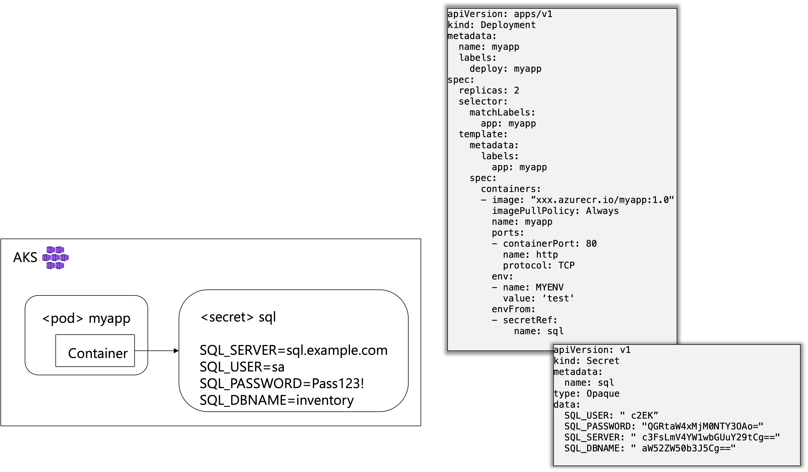
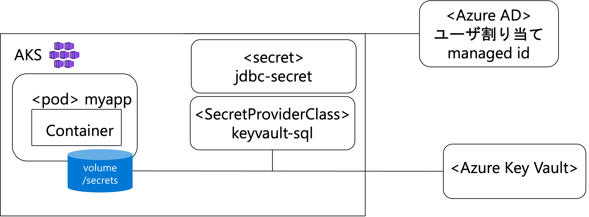

# DBアクセスに利用するパスワードの保存

AKS上のアプリケーションからDBにアクセスする場合のパスワードの渡し方は大きく3つ。環境変数で渡す方法は手軽だがマニフェストにパスワードを記述してしまうのでプロダクション環境には避けた方が良い。

* 環境変数に保存
* Kubernetesのsecretに保存
* Azure Key Vaultに保存


## 環境変数の準備

リソースグループ、AKSのクラスタ名、Key Vault名、Yellowfinアプリをデプロイするk8sのネームスペースを環境変数に設定します。

```
export RG_NAME=mygroup
export AKS_NAME=myaks
export KV_NAME=mykv
export YF_NS=yellowfin
```


## kubernetesのsecretに保存する方法

kubernetesには、Podの外部に値を保持するしくみとしてConfigMapとSecretがある。Secretは秘匿情報を保持するために利用する。

[Kubernetes公式ドキュメント - secret](https://kubernetes.io/ja/docs/concepts/configuration/secret/)



### secretの登録

Secretのyamlファイルを作成する場合、値はbase64でエンコードしておく必要がある。
[サンプル manifest/secret.yaml](./manifest/secret.yaml)

base64エンコーディングの実行例
```
echo "password123!" | base64
```

その他、kubectlコマンドを使ってファイルにkey/valueを平文で記入しkubectlコマンドで作成することも可能。

sql.env というファイルに `key=value` を記入して、kubectlコマンドで登録する場合は次のような手順になる。

#### (1) Key/Valueのファイルを作成

jdbc.env
```
JDBC_CONN_PASS=Password123!
JDBC_CONN_ENCRYPTED=false
JDBC_CONN_URL=jdbc:postgresql://yellowfinpg.postgres.database.azure.com:5432/yellowfin?sslmode=require
JDBC_CONN_USER=myadmin
```
#### (2) kubectl コマンドでsecret作成

```
kubectl create secret generic jdbc-secret --from-env-file=jdbc.env -n $YF_NS
```

`kubectl create secret generic jdbc-secret --from-env-file=sql.env -o yaml` のように　`-o yaml` をつけると、YAMLファイルが作成される。

### アプリケーションのデプロイ

[サンプル manifest/deployment_secret.yaml](./manifest/deployment_secret.yaml)を利用して、Yellowfinアプリケーションをデプロイ。

```
kubectl apply -f deployment_secret.yaml -n $YF_NS
```

## Azure Key Vaultに保存する方法

もっと安全にパスワードを保存する場合には Azure Key VaultのSecretとしてDBのアクセス情報を保持する。



### AKSの拡張機能の設定

Secret Store CSI Driverを利用する拡張機能を有効にする。

```
az aks enable-addons \
    -g $RG_NAME \
    -n $AKS_NAME \
    --addons azure-keyvault-secrets-provider
```

Secret Store CSI DriverとAzure Key Vaultプロバイダーがインストールされたことを確認する。

```
kubectl get pods -n kube-system -l 'app in (secrets-store-csi-driver, secrets-store-provider-azure)'
```

### Azure Key Vaultの設定

Azure Key Vaultがデプロイされていない場合はデプロイする。

Key Vaultにアクセスするときに利用する、AKSのユーザ割り当てマネージドIDを確認し、環境変数に設定する。

```
export SECRETS_PROVIDER_IDENTITY=$(az aks show \
    -g $RG_NAME \
    -n $AKS_NAME \
    --query "addonProfiles.azureKeyvaultSecretsProvider.identity.clientId" -o tsv)
```

AKSがAzure Key Vaultのシークレットにアクセスすることを許可する。
```
az keyvault set-policy -n $KV_NAME --secret-permissions get --spn $SECRETS_PROVIDER_IDENTITY    
```

### Azure Key VaultにSecretを登録

Azure Key Vaultをデプロイして、secretとしてUSER、PASSWORD、ENCRYPTED、JDBCURL、を登録する。
※Azure Key Vaultでは、キーに「`_`」が使えない


```
az keyvault secret set --vault-name $KV_NAME -n USER --value [値]
az keyvault secret set --vault-name $KV_NAME -n PASSWORD --value [値]
az keyvault secret set --vault-name $KV_NAME -n ENCRYPTED --value false
az keyvault secret set --vault-name $KV_NAME -n JDBCURL --value [値]
```


### Azure Key Vaultを利用したデプロイ

シークレット ストア CSI ドライバーに Azure Key Vault プロバイダーを使用すると、CSI ボリューム経由で Azure Key Vault をシークレット ストアとして Azure Kubernetes Service (AKS) クラスターと統合できる。

#### (1) SecretProviderClass をデプロイ

[サンプル manifest/secretprovider.yaml](./manifest/secretprovider.yaml)を編集して、シークレットプロバイダーをデプロイする。

```
kubectl apply -f secretprovider.yaml -n $YF_NS
```

#### (2) アプリケーションのデプロイ

[サンプル manifest/deployment_keyvault.yaml](./manifest/deployment_keyvault.yaml) を利用してアプリケーションをデプロイする。

```
kubectl apply -f deployment_keyvault.yaml -n $YF_NS
```


## 参考
* https://learn.microsoft.com/ja-jp/azure/aks/csi-secrets-store-driver