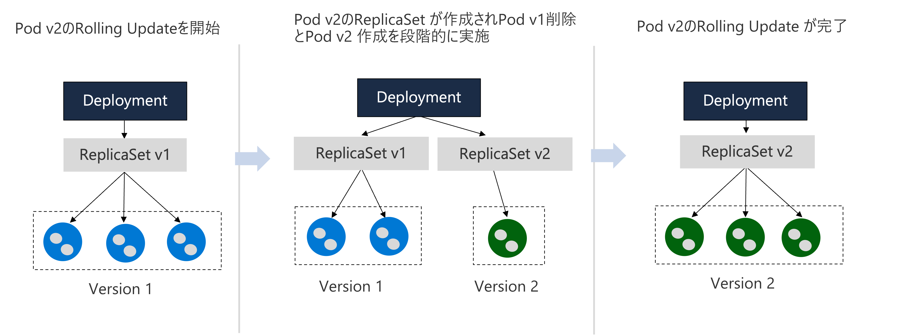
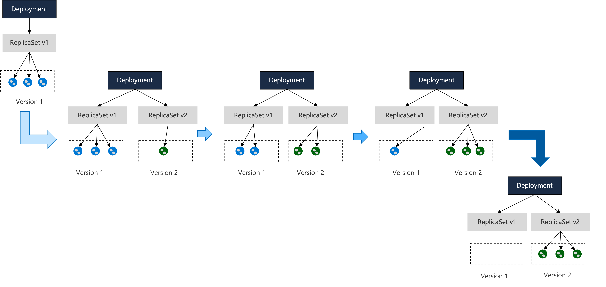
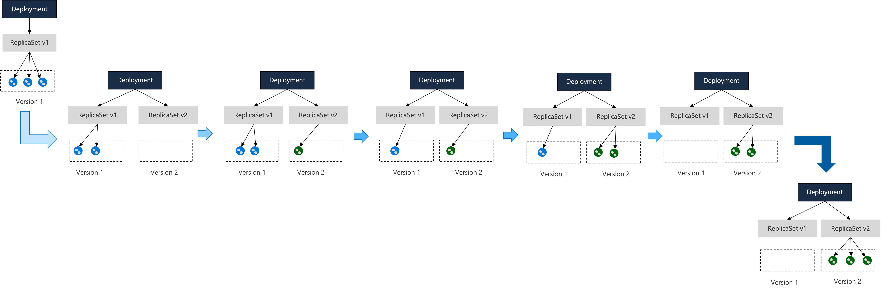

# アプリケーションの更新

## Docker Imageのタグを更新した場合

デプロイメントのマニフェストでimageの記述を更新して、適用する

```
kubectl apply -f deployment.yaml -n [ネームスペース]
```


## Docker Imageのタグは変わらずイメージがアップデートされた場合

デプロイメントの名前を確認

```
kubectl get deployment -n [ネームスペース]

NAME    READY   UP-TO-DATE   AVAILABLE   AGE
hello   1/1     1            1           162m
```

確認したデプロイメント名を指定して、ロールアウトを実施。デプロイメントが `hello` でネームスペースが `demo` の場合。
```
kubectl rollout restart deployment/hello -n demo
```

ロールアウトのステータスを確認
```
kubectl rollout status deployment/hello -n demo
```

※ deploymentで指定しない場合はImagePullPolicyがAlways（コンテナを起動する時はコンテナイメージを確認して、ダイジェストがアップデートされていたらpullする）ので、Image タグが同じでもrolloutを実行することで新しいイメージを利用してPodが起動される

## アプリケーションのロールバック

deploymentをロールバックすることで、アプリケーションを以前のバージョンに戻すことができる。

リビジョンの履歴を確認
```
kubectl rollout history deployment/hello -n demo

---コマンドの出力結果----
deployment.apps/hello 
REVISION  CHANGE-CAUSE
1         <none>
2         <none>
```

リビジョンを 1 に戻す。

```
kubectl rollout undo deployment/hello --to-revision=1 -n demo
```

リビジョンの履歴を再度確認

```
kubectl rollout history deployment/hello -n demo

--- コマンドの出力結果 ---
deployment.apps/hello 
REVISION  CHANGE-CAUSE
2         <none>
3         <none>
```

※ ロールアウトすると、最新のリビジョン番号が追加される


## DeploymentとReplicaSet

* ReplicaSetは、指定されたレプリカ数を維持するためにPodの作成と削除を行う
* Deploymentは、ReplicaSetを管理する

### ローリングアップデート

同じデプロイメント配下のPodを段階的に入れ替えることでサービスを停止することなくアップデートを実現する。




ローリングアップデート時には、MaxSurgeで指定したレプリカ数よりも一時的に増やして良い最大のPod数をパーセンテージが個数で、MaxUnavailableは指定したレプリカ数よりも減らして良い最大のPod数をパーセンテージか個数で指定。

※ Deploymentでとくに指定しない場合は、MaxSurge 25%、MaxUnavailable 25%がデフォルトで指定される。


#### ローリングアップデートの仕組み

レプリカ数 3 で、MaxUnavailable 0, MaxSurge 1 の場合

MaxUnavailableが0なのでローリングアップデート中にレプリカ数は3より減らしてはいけない、MaxSurgeが1なのでローリングアップデート中の余剰Podは3+1で4つまでとなる。
なので、新しいPodが一つ起動されると古いPodを一つ減らしてという動作になる。




レプリカ数 3 で、MaxUnavailable 1, MaxSurge 0の場合

MaxUnavailableが1なのでローリングアップデート中にレプリカ数は1つ減らしても良い、MaxSurgeが0なのでローリングアップデート中のポッド数は3以下となる。



